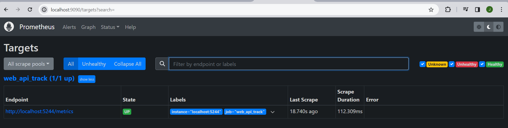
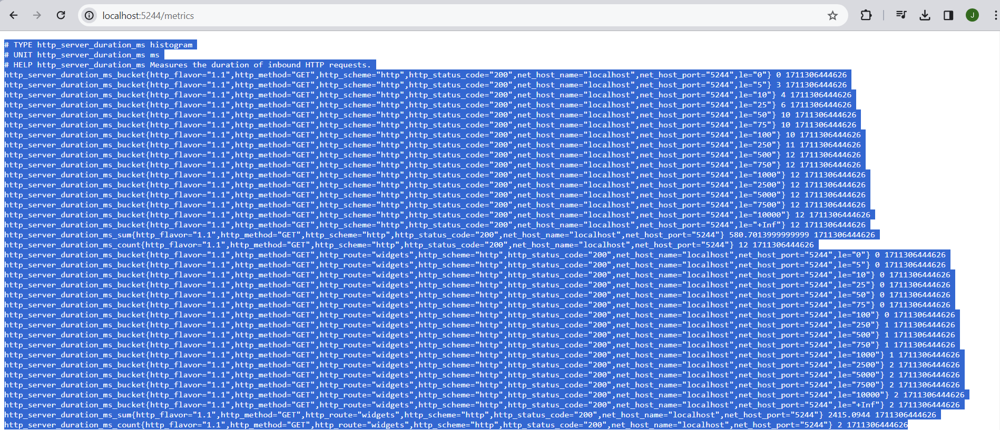
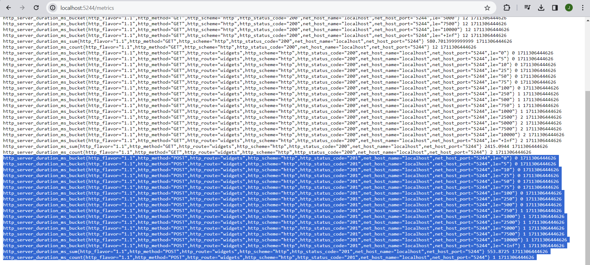
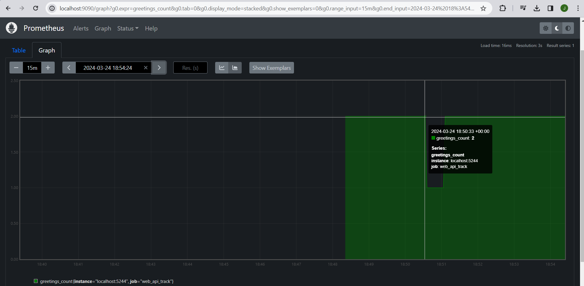
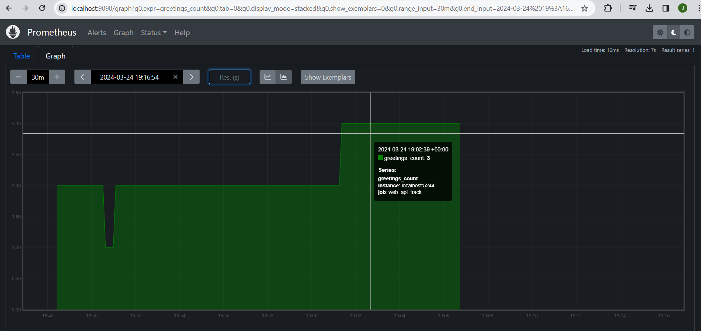
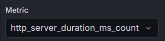
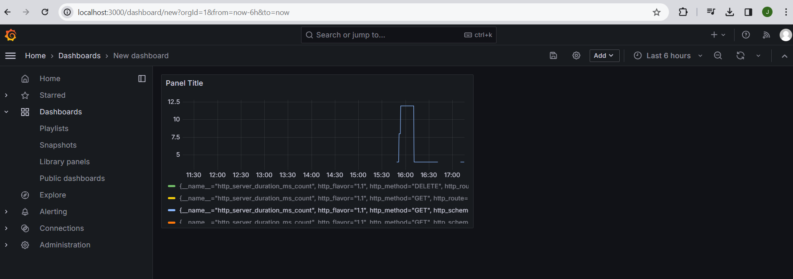

# Instrumentando-coleta-de-metricas-com-OpenTelemetry

## Prometheus:

### Conclusão:

Após a implementação e configuração do Prometheus para o monitoramento da aplicação Web.API.Track, observamos uma coleta de métricas robusta e detalhada. A aplicação, executando no localhost:5244, expõe métricas de tempo de resposta e contagem de requisições que são essenciais para avaliar o desempenho e a saúde do sistema. As métricas do histograma de duração HTTP mostram uma distribuição de latências de resposta, enquanto o contador de saudações oferece uma visão direta da utilização do endpoint de saudações. A interface do Prometheus permite visualizar estas métricas ao longo do tempo, oferecendo uma ferramenta valiosa para análise e otimização contínua.

## Grafana:

### Conclusão:

A métrica escolhida "http_server_duration_ms_count" indica a contagem de requisições, categorizadas por método HTTP. 

 O painel mostra um gráfico de barras com poucos pontos de dados, indicando que em determinados períodos houve picos nas métricas observadas. Este dashboard é uma ferramenta para monitorar o desempenho e a saúde das aplicações web, permitindo identificar tendências e possíveis problemas em tempo real.

## Tecnologia:

Explorar a observabilidade no .NET com o OpenTelemetry oferece uma perspectiva abrangente sobre o desempenho e a saúde dos aplicativos, permitindo a detecção proativa de problemas.O OpenTelemetry, é um padrão para coleta de telemetria, que possibilita a integração com sistemas APM, destacando-se o Prometheus para coleta e agregação de métricas e o Grafana para visualização e criação de dashboards. 

### Prometheus:

Prometheus se destaca pela sua capacidade de coletar, armazenar e consultar métricas em tempo real.

### Grafana:

 Grafana permite a criação de visualizações ricas para monitorar o desempenho dos aplicativos.

## Aprendizado pessoal:

Aprendi sobre a importância dos três pilares da observabilidade: logs, métricas e rastreamento distribuído. Entendi como o OpenTelemetry oferece um padrão aberto para coletar e emitir dados de telemetria, facilitando a integração com sistemas APM como Prometheus, Grafana e Jaeger. Na prática, configurei uma aplicação .NET para emitir métricas e logs, utilizei o Prometheus para coleta de métricas e o Grafana para visualização, culminando na configuração de um dashboard. Este processo reforçou a importância da observabilidade para monitorar e diagnosticar aplicações em produção.

